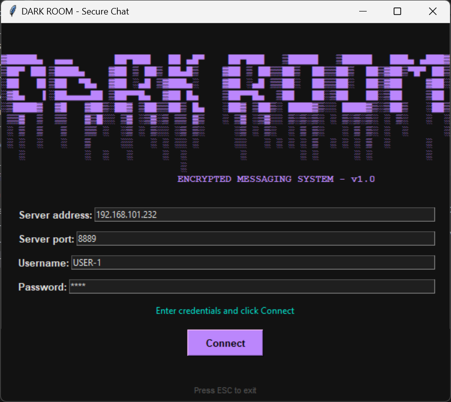
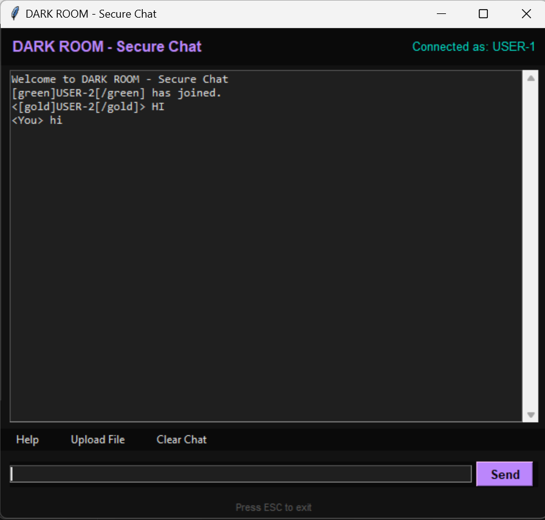
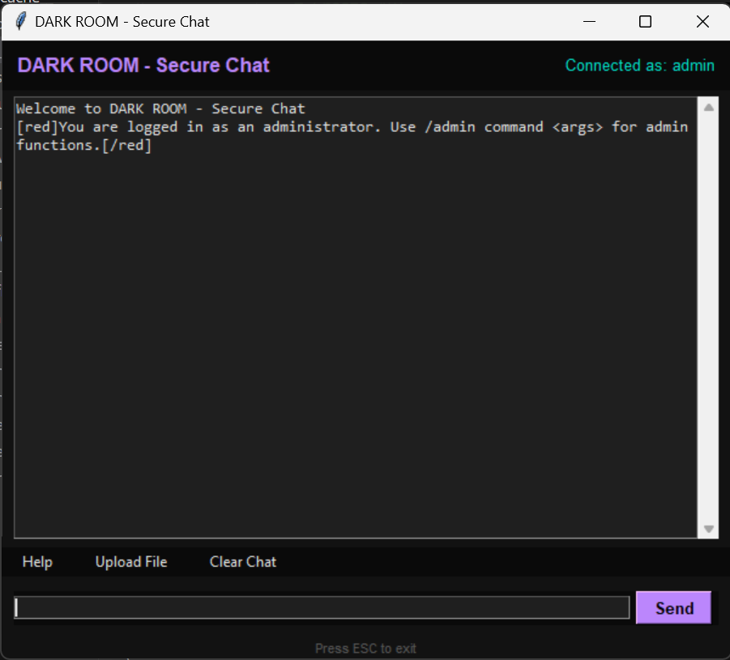

# 🔐 Secure Chatroom

<div align="center">


</div>

## 📋 Table of Contents
- [Introduction](#introduction)
- [Features](#features)
- [Screenshots](#screenshots)
- [System Architecture](#system-architecture)
- [Installation & Setup](#installation--setup)
- [Usage Guide](#usage-guide)
- [Security Features](#security-features)
- [Technologies Used](#technologies-used)
- [Project Structure](#project-structure)
- [Configuration](#configuration)
- [API Documentation](#api-documentation)
- [Troubleshooting](#troubleshooting)
- [Contributing](#contributing)
- [License](#license)

## 📖 Introduction
The **Secure Chatroom** is a real-time messaging system designed to provide secure communication between users. It ensures that messages and files are transmitted securely using RSA encryption and includes features like user authentication, file sharing, and administrative controls. The project addresses the need for privacy and security in online communication by implementing robust security mechanisms.

---

## ✨ Features

### 🔐 Security Features
- **RSA Encryption**: End-to-end encryption for all messages and file transfers
- **Password Hashing**: MD5 hashing for secure password storage
- **IP Banning**: Automatic blocking of malicious users
- **Admin Controls**: Restricted administrative commands

### 👤 User Management
- **User Authentication**: Secure login with username/password
- **Session Management**: Unique session handling for each client
- **Multi-user Support**: Concurrent user connections with threading

### 💬 Communication Features
- **Real-time Messaging**: Instant message delivery
- **File Sharing**: Secure file transfer with encryption
- **Chat History**: Persistent message storage and retrieval
- **Admin Commands**: Special commands for administrators

### 🖥️ User Interface
- **GUI Application**: User-friendly Tkinter interface
- **Cross-platform**: Works on Windows, macOS, and Linux
- **Intuitive Design**: Easy-to-use chat interface

---

## 📸 Screenshots

### Login Window


### Main Chat Interface


### Admin Panel



---

## 🏗️ System Architecture

```
┌─────────────────┐    ┌─────────────────┐    ┌─────────────────┐
│   Client App    │    │   Client App    │    │   Client App    │
│   (chat_app.py) │    │   (chat_app.py) │    │   (chat_app.py) │
└─────────┬───────┘    └─────────┬───────┘    └─────────┬───────┘
          │                      │                      │
          │         RSA Encrypted Communication         │
          │                      │                      │
          └──────────────────────┼──────────────────────┘
                                 │
                    ┌─────────────────┐
                    │  Server (main.py)│
                    │  - Authentication│
                    │  - Encryption    │
                    │  - Broadcasting  │
                    └─────────┬───────┘
                              │
                    ┌─────────────────┐
                    │ SQLite Database │
                    │ - Users         │
                    │ - Messages      │
                    │ - Files         │
                    │ - Banned IPs    │
                    └─────────────────┘
```

---

## 🚀 Installation & Setup

### Prerequisites
- Python 3.7 or higher
- pip (Python package manager)

### Step 1: Clone the Repository
```bash
git clone https://github.com/shivaraj245/Secure-Chatroom.git
cd Secure-Chatroom
```

### Step 2: Install Dependencies
```bash
cd client
pip install -r requirements.txt
```

**Required packages:**
- `rsa==4.9` - RSA encryption
- `anonfile==0.2.5` - File sharing
- `rich` - Terminal formatting

### Step 3: Configure Server
Edit `server/config.json`:
```json
{
    "ip": "127.0.0.1",           // Change to your server IP
    "port": 8889,                // Server port
    "buffer": 1024,              // Buffer size
    "welcome_message": "Welcome to DARK ROOM - Secure Chat",
    "protected_by_password": true,
    "password": "test",          // Default password
    "save_chat_history": true,
    "max_login_attempts": 3,
    "admin_commands_enabled": true,
    "database_file": "chat_database.db"
}
```

### Step 4: Run the Application

#### Start the Server
```bash
cd server
python main.py
```

#### Start the Client (in a new terminal)
```bash
cd client
python chat_app.py
```

---

## 📖 Usage Guide

### Default Credentials
- **Regular Users**: Password is `test`
- **Admin User**: Username `admin`, Password `admin123`

### User Commands
| Command | Description |
|---------|-------------|
| `/help` | Show help message |
| `/nick` | Display your nickname |
| `/upload` | Upload a file |
| `/clear` | Clear chat window |
| `/get #code` | Download shared file |
| `/exit` | Exit chat |

### Admin Commands
| Command | Description |
|---------|-------------|
| `/admin ban <username> <reason>` | Ban a user |
| `/admin history <number>` | View chat history |
| `/admin dbstats` | View database statistics |

### File Sharing
1. Click "Upload File" or type `/upload`
2. Select file (max 10MB)
3. File info is shared with a unique code
4. Others can download using `/get #code`

---

## 🔒 Security Features

### Encryption Implementation
- **RSA Algorithm**: Asymmetric encryption ensuring secure key exchange
- **Key Size**: 2048-bit RSA keys for robust security
- **Message Encryption**: All messages encrypted before transmission
- **File Encryption**: Files encrypted during transfer

### Authentication & Authorization
- **Password Hashing**: MD5 hashing for password storage
- **Session Management**: Unique session tokens for each client
- **Admin Verification**: Role-based access control for admin commands
- **Login Attempts**: Limited attempts to prevent brute force attacks

### Network Security
- **IP Banning**: Automatic blocking of malicious IP addresses
- **Connection Monitoring**: Real-time monitoring of client connections
- **Error Handling**: Secure error handling to prevent information leakage

---

## 🛠️ Technologies Used

| Component | Technology | Purpose |
|-----------|------------|---------|
| **Backend** | Python 3.7+ | Server-side logic and client application |
| **GUI** | Tkinter | Cross-platform graphical user interface |
| **Database** | SQLite | Local data storage and persistence |
| **Encryption** | RSA Library | Secure message and file encryption |
| **Networking** | Python Sockets | Client-server communication |
| **Threading** | Python Threading | Concurrent client handling |

---

## 📁 Project Structure

```
Securechatroom/
├── 📁 server/
│   ├── 🐍 main.py              # Main server application
│   ├── 🗄️ database.py          # Database management functions
│   ├── 👁️ dbview.py            # Database viewer utility
│   ├── ⚙️ config.json          # Server configuration
│   └── 🗃️ chat_database.db     # SQLite database (created at runtime)
├── 📁 client/
│   ├── 🖥️ chat_app.py          # Main client application
│   ├── 🔑 login_window.py      # Login interface
│   ├── 🔐 api.py               # Encryption API functions
│   ├── 📋 constants.py         # Application constants
│   ├── 📁 file_utils.py        # File sharing utilities
│   ├── 🌐 network.py           # Network configuration
│   └── 📋 requirements.txt     # Python dependencies
├── 📄 README.md                # Project documentation
└── 🚫 .gitignore              # Git ignore file
```

---

## ⚙️ Configuration

### Server Configuration (`server/config.json`)
```json
{
    "ip": "127.0.0.1",                    // Server IP address
    "port": 8889,                         // Server port
    "buffer": 1024,                       // Buffer size for data transmission
    "welcome_message": "Welcome message", // Server welcome message
    "protected_by_password": true,        // Enable password protection
    "password": "test",                   // Default room password
    "save_chat_history": true,            // Enable chat history saving
    "max_login_attempts": 3,              // Maximum login attempts
    "admin_commands_enabled": true,       // Enable admin commands
    "database_file": "chat_database.db"   // Database file name
}
```

### Client Configuration
- Server address and port can be configured in the login window
- File upload limits and encryption settings in `constants.py`

---

## 🔧 API Documentation

### Server API Functions

#### Database Operations
```python
def create_user(username, password_hash, is_admin=False)
def authenticate_user(username, password)
def save_message(username, message, timestamp)
def get_chat_history(limit=50)
def ban_user(username, reason, admin_username)
```

#### Encryption Functions
```python
def generate_rsa_keys()
def encrypt_message(message, public_key)
def decrypt_message(encrypted_message, private_key)
```

### Client API Functions

#### Network Operations
```python
def connect_to_server(host, port)
def send_message(message)
def receive_messages()
def upload_file(file_path)
def download_file(file_code)
```

---

## 🔍 Troubleshooting

### Common Issues and Solutions

#### Connection Issues
**Problem**: `socket.gaierror: [Errno 11001] getaddrinfo failed`
```
Solution: Check IP address in config.json for extra spaces or invalid format
```

**Problem**: Connection refused
```
Solution: Ensure server is running before starting client
```

#### Authentication Issues
**Problem**: Login failed with correct credentials
```
Solution: Check if user exists in database or if max attempts exceeded
```

#### File Sharing Issues
**Problem**: File upload fails
```
Solution: Check file size (max 10MB) and file permissions
```

### Debug Mode
Enable debug logging by modifying the server configuration:
```python
import logging
logging.basicConfig(level=logging.DEBUG)
```

---

## 🤝 Contributing

We welcome contributions! Please follow these steps:

1. **Fork the repository**
2. **Create a feature branch**
   ```bash
   git checkout -b feature/new-feature
   ```
3. **Make your changes**
4. **Add tests** (if applicable)
5. **Commit your changes**
   ```bash
   git commit -m "Add new feature"
   ```
6. **Push to your branch**
   ```bash
   git push origin feature/new-feature
   ```
7. **Create a Pull Request**

### Code Style Guidelines
- Follow PEP 8 Python style guide
- Add docstrings to all functions
- Include type hints where appropriate
- Write descriptive commit messages

---

## 📝 License

This project is licensed under the MIT License - see the [LICENSE](LICENSE) file for details.

```
MIT License

Copyright (c) 2025 Secure Chatroom Project

Permission is hereby granted, free of charge, to any person obtaining a copy
of this software and associated documentation files (the "Software"), to deal
in the Software without restriction, including without limitation the rights
to use, copy, modify, merge, publish, distribute, sublicense, and/or sell
copies of the Software, and to permit persons to whom the Software is
furnished to do so, subject to the following conditions:

The above copyright notice and this permission notice shall be included in all
copies or substantial portions of the Software.
```

---

## 👨‍💻 Author

**Shivaraj Manikashetti**
- GitHub: [@shivaraj245](https://github.com/shivaraj245)


---

## 🙏 Acknowledgments

- RSA encryption implementation using the `rsa` Python library
- GUI framework provided by Python's Tkinter
- Database management with SQLite
- File sharing capabilities with anonfile integration

---

<div align="center">

**⭐ Star this repository if you found it helpful!**

</div>